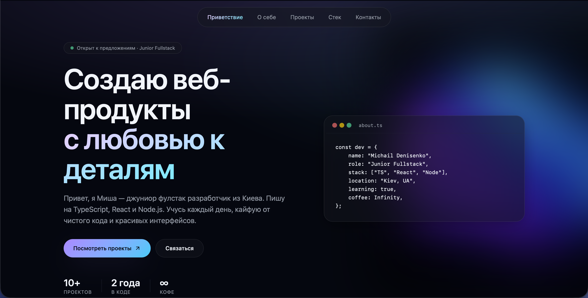

<div align="center">

# 👋 Personal Portfolio

Modern portfolio website built with **React**, **TypeScript**, **Vite**, and **Tailwind CSS**.

Designed to showcase my projects, skills, and experience with smooth animations and a clean UI.

[Live Demo](https://portfolio-eight-alpha-49.vercel.app) • [GitHub](https://github.com/MishaDenisenko/portfolio)

</div>

---

## ✨ Features

- 🎨 Modern responsive design
- ⚡ Built with Vite for fast performance
- 🌙 Dark theme
- ✨ Smooth animations and transitions
- 📱 Fully responsive layout
- 🧩 Modular component architecture
- 🚀 Optimized for production

---

## 🛠 Tech Stack

### Frontend

- React
- TypeScript
- Vite

### UI

- Tailwind CSS
- Lucide React

### Development

- ESLint
- Prettier

---

## 🚀 Getting Started

Clone the repository

```bash
git clone https://github.com/MishaDenisenko/portfolio.git
```

Go to the project directory

```bash
cd portfolio
```

Install dependencies

```bash
npm install
```

Start the development server

```bash
npm run dev
```

Build for production

```bash
npm run build
```

Preview production build

```bash
npm run preview
```

---

## 📸 Preview


---

## 📈 Lighthouse

- ✅ Performance
- ✅ Accessibility
- ✅ Best Practices
- ✅ SEO

---

## 📬 Contact

If you'd like to collaborate or have any questions, feel free to reach out.

- GitHub: https://github.com/MishaDenisenko
- Email: midenisenko@gmail.com
- LinkedIn: [Mykhailo Denysenko](https://www.linkedin.com/in/mykhailo-denysenko-93aa85288/)

---

## 📄 License

This project is licensed under the MIT License.

---

<div align="center">

Made by **Misha Denisenko**

</div>
